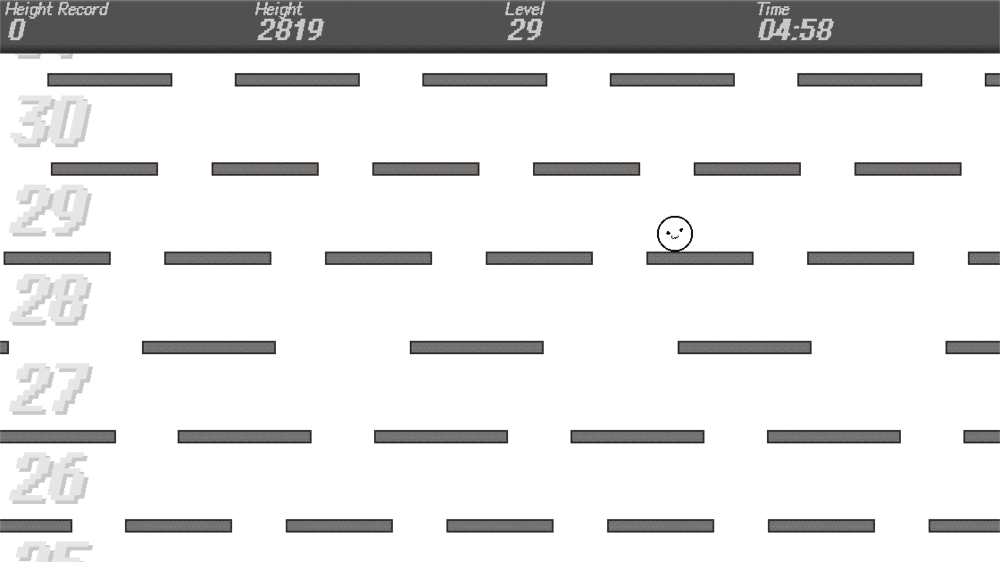

# Bounce!
A kusoge which only need one button to play, bouncing toward the other side of the universe.  
一款只需要一個按鍵，只需要往上跳的小糞game。中文版說明列於中段。  
ボタン一つだけでプレイできるクソゲーです。日本語の説明は下半に書いてあります。


For Windows users who are not familiar to Github, you can also download the files  from [MEGA](https://mega.nz/folder/8Zk3CLgL#hvHz4LAo_ctMnYyJixj7Yw) (no setup needed).  
不熟悉Github的Windows用戶也可以從[MEGA](https://mega.nz/folder/8Zk3CLgL#hvHz4LAo_ctMnYyJixj7Yw)下載（無須額外設置）。  
Githubに慣れていないWindowsの方は[MEGA](https://mega.nz/folder/8Zk3CLgL#hvHz4LAo_ctMnYyJixj7Yw)からもダウンロードできます（セットアップ不要）。

# English version
## Requirements
### OS
Windows 10 and above (tested). Likely works on macOS and Unix.
### Python
Python 3.12 and above.

## Setup
The setup instructions are based on Windows OS. For macOS and Unix users, the setup may be different.
### Install python
Go to the [official website](https://www.python.org/downloads/), download and then install the desired version (3.12+) of python. *Remember to add python to path at the setup page.*
### Download repository
[Download](https://github.com/squarecattest/Bounce/releases) the files to any suitable environment. After downloading, open command prompt(cmd) or PowerShell in that folder.
### Install packages
Run the following command in cmd/PowerShell:
```script
pip install -r requirements.txt
```  
Windows users can instead run the `packages.bat` file in the folder.
### Run the code
Run the following command in cmd/PowerShell:
```script
py .
```  

## License
### Font
The font is licensed by [SIL Open Font License 1.1](https://openfontlicense.org/), which is also appended [here](./fonts/OFL.txt).
### BGM
The background music follows the terms of use listed [here](https://nagumorizu.studio.site/wWph5RW1/tos).
### Others
Any other resource is licensed by [the Unlicense](https://unlicense.org/).

## Credits
### BGM
Magic Item Shop - by 南雲莉翠  
[Youtube(music)](https://youtu.be/2OgWuuPh4Go)  
[Youtube Channel](https://www.youtube.com/@nagumorizu)  
[X (formerly Twitter)](https://twitter.com/nagumorizu)  
[Homepage](https://nagumorizu.studio.site/)
### Font
Cubic 11 - by ACh  
[Source Code](https://github.com/ACh-K/Cubic-11)
### SE
bounce sound - from sfxr by Tomas Pettersson  
[Website](https://sfxr.me/)  
[Homepage](http://www.drpetter.se/project_sfxr.html)  
[Source Code](https://github.com/chr15m/jsfxr)


# 中文版
## 系統需求
### 作業系統
Windows 10或以上。可能支援macOS和Unix系統。
### Python
Python 3.12或以上。

## 設置
本設置說明基於Windows作業系統。對於macOS和Unix的用戶，設置過程可能略有不同。
### 安裝python
在[官網](https://www.python.org/downloads/)下載並安裝適合的python版本（3.12+）。*在安裝介面記得將python新增至系統路徑（add python to PATH）。*
### 下載檔案
將檔案[下載](https://github.com/squarecattest/Bounce/releases)至適合的環境。下載完後，在該資料夾中開啟命令提示字元（cmd）或PowerShell。
### 安裝套件
在Cmd/PowerShell中執行下列指令：
```script
pip install -r requirements.txt
```  
作為替代，Windows用戶也可以執行資料夾中的`packages.bat`批次檔。
### 執行程式碼
在Cmd/PowerShell中執行下列指令：
```script
py .
```  

## 授權
### 字型
使用的字型遵循[SIL開源字型授權條款v1.1](https://openfontlicense.org/)。授權條款也附於[此處](./fonts/OFL.txt)。
### 背景音樂
使用的背景音樂遵循[此處](https://nagumorizu.studio.site/wWph5RW1/tos)記述的使用條款。
### 其他
任何其他資源遵循[Unlicense](https://unlicense.org/)。

## Credits
### 背景音樂
Magic Item Shop - 作曲：南雲莉翠  
[Youtube(曲目)](https://youtu.be/2OgWuuPh4Go)  
[Youtube頻道](https://www.youtube.com/@nagumorizu)  
[X (原Twitter)](https://twitter.com/nagumorizu)  
[首頁](https://nagumorizu.studio.site/)
### 字型
Cubic 11 - 製作：ACh  
[原始碼](https://github.com/ACh-K/Cubic-11)
### 音效
bounce sound - 由 Tomas Pettersson 製作的 sfxr  
[網站](https://sfxr.me/)  
[首頁](http://www.drpetter.se/project_sfxr.html)  
[原始碼](https://github.com/chr15m/jsfxr)

# 日本語版
## 動作環境
### オペレーティングシステム
Windows 10以降。macOSあるいはUnixで実行できる可能性があります。
### Python
Python 3.12以降。

## セットアップ
このセットアップ指示はWindowsの方向けの内容です。オペレーティングシステムによって若干異なります。
### Pythonをインストール
[公式サイト](https://www.python.org/downloads/)で適切なバージョン（3.12+）をダウンロードしてインストールします。*「Add python to PATH」のチェックをご確認ください。*
### リポジトリをダウンロード
[リポジトリ](https://github.com/squarecattest/Bounce/releases)を適切な環境にダウンロードし、そのフォルダーでコマンドプロンプト（cmd）あるいはPowerShellを起動します。
### パッケージをインストール
Cmd/PowerShellで以下のコマンドを実行します：
```script
pip install -r requirements.txt
```  
Windowsの方はその代わりにフォルダー内の`packages.bat`ファイルの実行もできます。
### コードを実行
Cmd/PowerShellで以下のコマンドを実行します：
```script
py .
```  

## ライセンス
### フォント
フォントは[SIL Open Font License 1.1](https://openfontlicense.org/)が適用されます。[ここ](./fonts/OFL.txt)でも記述されています。
### BGM
BGMは[この利用規約](https://nagumorizu.studio.site/wWph5RW1/tos)が適用されます。
### 他
他のリソースはすべて[Unlicense](https://unlicense.org/)が適用されます。

## クレジット
### BGM
Magic Item Shop - 南雲莉翠 様  
[Youtube(曲)](https://youtu.be/2OgWuuPh4Go)  
[Youtubeチャンネル](https://www.youtube.com/@nagumorizu)  
[X (元Twitter)](https://twitter.com/nagumorizu)  
[ホームページ](https://nagumorizu.studio.site/)
### フォント
Cubic 11 - ACh 様  
[ソースコード](https://github.com/ACh-K/Cubic-11)
### SE
バウンド - Tomas Pettersson 様による sfxr  
[サイト](https://sfxr.me/)  
[ホームページ](http://www.drpetter.se/project_sfxr.html)  
[ソースコード](https://github.com/chr15m/jsfxr)