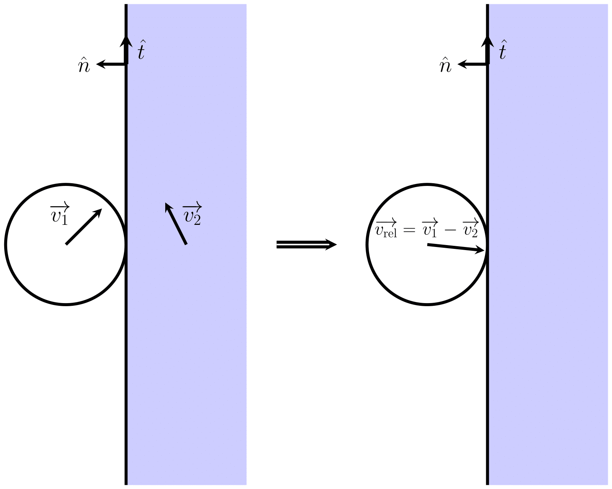
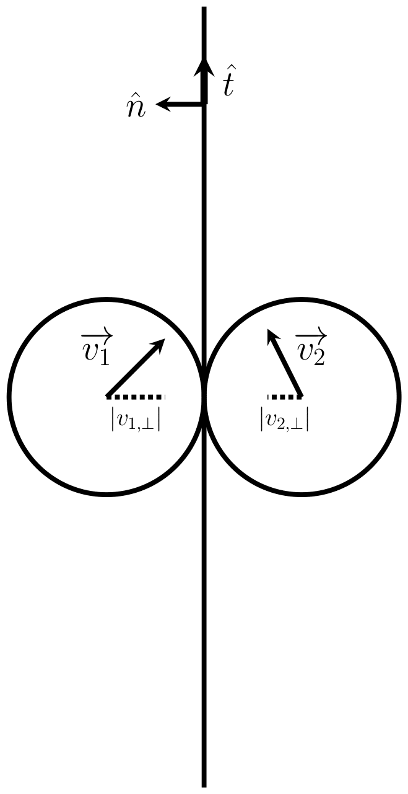
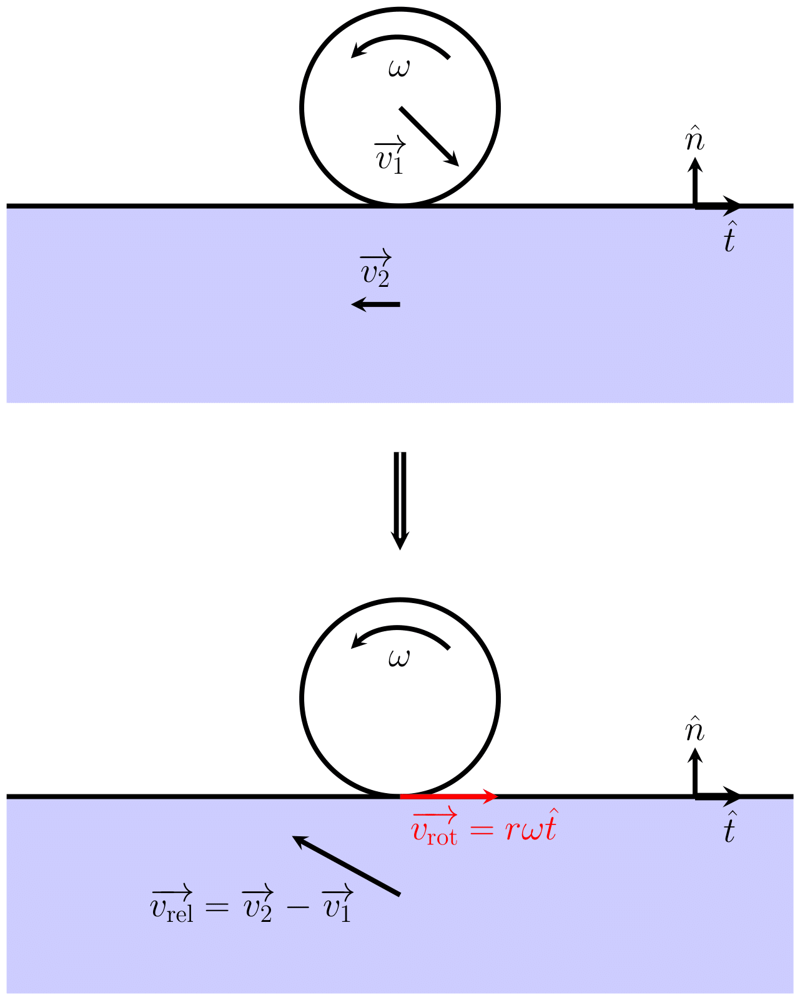

# Physics of collision and friction
## Linear Contraction
We use linear contraction as velocity loss in the following context. Two kinds of contraction is used: tick-based and time-based. 

### Tick-based linear contraction
A tick-based contraction is used when the contraction is applied of a sudden. The transformation is formulated as:
$$\begin{aligned}
f(t=0)&\rightarrow f(t=\Delta t)\\
&=\text{LC}_{\text{tick}}(f(0), \alpha, \beta)\\
&\equiv\max(\alpha f(0)-\beta, \;0)
\end{aligned}$$
Here $\alpha$ is the multiplier, which is a number between $0$ and $1$; $\beta$ is the subtraction constant, which is a non-negative number; $\Delta t$ is the time interval of a tick.

### Time-based linear contraction
A tick-based contraction is used when the contraction is continuously applied. The transformation is formulated as:
$$\begin{aligned}
f(t=0)&\rightarrow f(t=dt)\\
&=\text{LC}_{\text{time}}(f(0), dt, \gamma, \delta)\\
&\equiv\max(f(0)-dt\cdot(\gamma f(0)+\delta), \;0)
\end{aligned}$$
Here $\gamma$ is the slope multiplier, which is a positive number; $\delta$ is the additional slope constant, which is a non-negative number; $dt$ is a small time interval.

### Change from tick-based to time-based
Suppose that we are using a tick-based contraction and the value never reaches zero. After $n$ ticks, the value is transformed to:
$$\begin{aligned}
f(n\Delta t)&={\text{LC}_{\text{tick}}}^{n}(f(0), \alpha, \beta)\\
&=\alpha(\alpha(\alpha(\dots)-\beta)-\beta)-\beta\\
&=\alpha^{n}f(0)-\alpha^{n-1}\beta-\alpha^{n-2}\beta-\dots-\beta\\
&=\alpha^{n}f(0)-\beta\sum_{k=0}^{n-1}\alpha^{k}\\
&=\alpha^{n}f(0)-\beta\frac{1-\alpha^{n}}{1-\alpha}
\end{aligned}$$
Change to function of time by $t=n\Delta t,\;n=\frac{t}{\Delta t}$:
$$f(t)=\alpha^{\frac{t}{\Delta t}}f(0)-\beta\frac{1-\alpha^{\frac{t}{\Delta t}}}{1-\alpha}$$
Take the derivaitve:
$$f^{\prime}(t)=\frac{\log{\alpha}}{\Delta t}\alpha^{\frac{t}{\Delta t}}f(0)+\frac{\beta\frac{\log{\alpha}}{\Delta t}\alpha^{\frac{t}{\Delta t}}}{1-\alpha}$$
The value after a small time interval can be calculated by its taylor seires at $t=0$ to the first order:
$$\begin{aligned}
f(dt)&\approx f(0)+dt\cdot f^{\prime}(0)\\
&=f(0)+dt\cdot\left(\frac{\log{\alpha}}{\Delta t}f(0)+\frac{\beta\frac{\log{\alpha}}{\Delta t}}{1-\alpha}\right)\\
&=\boxed{f(0)-dt\cdot\left(\frac{-\log{\alpha}}{\Delta t}f(0)+\frac{-\beta\log{\alpha}}{\Delta t(1-\alpha)}\right)}
\end{aligned}$$
Therefore the time-based constants are $\gamma=\frac{-\log{\alpha}}{\Delta t}$ and $\delta=\frac{-\beta\log{\alpha}}{\Delta t(1-\alpha)}$.

### Change from time-based to tick-based
Suppose that we are using a time-based contraction and the value never reaches zero. The general solution can be derived from the differential equation:
$$
f^{\prime}(t)=-\gamma f(t)-\delta\\
f^{\prime}(t)+\gamma f(t)=-\delta\\
e^{\gamma t}f^{\prime}(t)+\gamma e^{\gamma t}f(t)=-\delta e^{\gamma t}\\
e^{\gamma t}f(t)=-\frac{\delta}{\gamma}e^{\gamma t}+C\\
f(t)=-\frac{\delta}{\gamma}+Ce^{-\gamma t}\\
t=0\Rightarrow C=f(0)+\frac{\delta}{\gamma}\\
f(t)=-\frac{\delta}{\gamma}+\left(f(0)+\frac{\delta}{\gamma}\right)e^{-\gamma t}\\
\boxed{f(\Delta t)=e^{-\gamma\Delta t}f(0)-\frac{\delta}{\gamma}(1-e^{-\gamma\Delta t})}
$$
Therefore the tick-based constants are $\alpha=e^{-\gamma\Delta t}$ and $\beta=\frac{\delta}{\gamma}(1-e^{-\gamma\Delta t})$. The two parameter transformations are consistent with each other.

## Collision
### Collision with massive object
First we consider a collision between a ball and a massive object. Let the velocity and the mass of the ball be $\overrightarrow{v_{1}}, m_{1}$ respectively, and $\overrightarrow{v_{2}}, m_{2}$ for the massive object. Also, let the normal unit vector of the contact point be $\hat{n}$, and the tangent unit vector be $\hat{t}$. For convenience, we choose change the frame of reference from background frame to object frame (since the object is considered to infinitely massive, this is also the center-of-mass frame). The velocity of the ball in this frame is thus:
$$\overrightarrow{v_{\text{rel}}}=\overrightarrow{v_{1}}-\overrightarrow{v_{2}}$$

A collision occurs if and only if the ball is moving toward to the object, i.e. $\overrightarrow{v_{\text{rel}}}\cdot\hat{n}<0$. For now, assume that the collision is perfectly elastic. We split the velocity to parallel and perpendicular components (relative to the surface): 
$$\overrightarrow{v_{\text{rel}}}=v_{\text{rel}, \perp}\cdot\hat{n}+v_{\text{rel}, \parallel}\cdot\hat{t}$$
The parallel component of the velocity is invariant, and the perpendicular component is trasformed by *one-dimensional elastic collision*:
$$v_{\text{rel, }\perp}\rightarrow v_{\text{rel, }\perp}^{\prime}=\frac{m_{1}-m_{2}}{m_{1}+m_{2}}v_{\text{rel, }\perp}+\frac{2m_{2}}{m_{1}+m_{2}}\cdot0$$
Then we take the mass limit $m_{2}\to\infty$:
$$v_{\text{rel, }\perp}\rightarrow v_{\text{rel, }\perp}^{\prime}=-v_{\text{rel, }\perp}$$
which is the formula for a two-dimensional perfectly elastic collision. Now we add the energy loss to the system. We simplify the energy loss to a ticked-based linear velocity contraction:
$$v_{\text{rel, }\perp}^{\prime}\rightarrow v_{\text{rel, }\perp}^{\prime\prime}=\text{LC}_{\text{tick}}(v_{\text{rel, }\perp}^{\prime}, \alpha_{c}, \beta_{c})$$
where $\alpha_{c}$ and $\beta_{c}$ are the collision parameters which can be set arbitrarily. Therefore the total transformation of the perpendicular velocity is:
$$\boxed{v_{\text{rel, }\perp}\rightarrow v_{\text{rel, }\perp}^{\prime\prime}=\text{LC}_{\text{tick}}(-v_{\text{rel, }\perp}, \alpha_{c}, \beta_{c})}$$
By adding back the parallel component and then change back to background frame (by adding the velocity of the massive object) we can get the final velocity of the ball after collision. We also apply friction when in collision, which affects the parallel component of the velocity. See [the next section](#sliding-friction).

### Collision with another ball
Now we consider the collision between two balls. Let the velocity and the mass of one of the ball be $\overrightarrow{v_{1}}, m_{1}$ respectively, and $\overrightarrow{v_{2}}, m_{2}$ for another one. Also, let the normal unit vector of the contact point be $\hat{n}$, and the tangent unit vector be $\hat{t}$.

A collision occurs if and only if the balls are moving toward each other, i.e. $(\overrightarrow{v_{1}}-\overrightarrow{v_{2}})\cdot\hat{n}<0$. Again, we split the velocity to parallel and perpendicular components:
$$
\overrightarrow{v_{1}}=v_{1, \perp}\cdot\hat{n}+v_{1, \parallel}\cdot\hat{t}\\
\overrightarrow{v_{2}}=v_{2, \perp}\cdot\hat{n}+v_{2, \parallel}\cdot\hat{t}
$$ 
The transformation of perpendicular component follows the one-dimensional elastic collision:
$$v_{1, \perp}\rightarrow v_{1, \perp}^{\prime}=\frac{m_{1}-m_{2}}{m_{1}+m_{2}}v_{1, \perp}+\frac{2m_{2}}{m_{1}+m_{2}}\cdot v_{2, \perp}\\
v_{2, \perp}\rightarrow v_{2, \perp}^{\prime}=\frac{m_{2}-m_{1}}{m_{2}+m_{1}}v_{2, \perp}+\frac{2m_{1}}{m_{2}+m_{1}}\cdot v_{1, \perp}$$
Since the mass of the two balls are the same ($m_{1}=m_{2}$), the transformation simplifies to:
$$
v_{1, \perp}\rightarrow v_{1, \perp}^{\prime}=v_{2, \perp}\\
v_{2, \perp}\rightarrow v_{2, \perp}^{\prime}=v_{1, \perp}
$$
which is just the switch of the perpendicular components. With energy loss, the total transformation of the perpendicular velocity is:
$$
\boxed{v_{1, \perp}\rightarrow v_{1, \perp}^{\prime\prime}=\text{LC}_{\text{tick}}(v_{2, \perp}, \alpha_{c}, \beta_{c})}\\
\boxed{v_{2, \perp}\rightarrow v_{2, \perp}^{\prime\prime}=\text{LC}_{\text{tick}}(v_{1, \perp}, \alpha_{c}, \beta_{c})}
$$
By adding back the parallel component we can get the final velocity of the ball after collision.

## Sliding Friction
When the ball is on the surface and the contact point has a relative motion to the surface, there will be a friction applied on the contant point of the ball, pointing to the opposite direction of the relative velocity. This friction, which is the so-called **sliding friction**, will rotate the ball towards a *pure rotation* motion. 

Let the velocity of the ball and the object be $\overrightarrow{v_{1}}, \overrightarrow{v_{2}}$ respectively, $M$ be the mass of the ball, and $\omega$ be the angular frequency of the ball, with positive sign representing a counterclockwise rotation. Also, let the normal unit vector of the contact point be $\hat{n}$, and the tangent unit vector be $\hat{t}$, pointing towards the direction of the velocity of the contact point when the angular frequency is positive. This time, we change to the ball frame. The velocity of the object in this frame is:
$$\overrightarrow{v_{\text{rel}}}=\overrightarrow{v_{2}}-\overrightarrow{v_{1}}$$
And the velocity of the contact point due to the rotation is:
$$\overrightarrow{v_{\text{rot}}}=r\omega\hat{t}$$

Althogh sliding friction is only dependent on the normal force and texture in reality, in this game, we construct friction to be **velocity-dependent**, for the purpose of better visual effect. The sliding friction is given by:
$$\overrightarrow{F_{s}}=-\hat{v}(kv+c)$$
where $\overrightarrow{v}$ is the velocity of the contact point relative to the surface, $\hat{v}=\frac{\overrightarrow{v}}{|\overrightarrow{v}|}$ is the unit vector with the direction of $\overrightarrow{v}$, $v=|\overrightarrow{v}|$ is the magnitude of $\overrightarrow{v}$, and $k, c>0$ are arbitrarily given constants.

We go back to our case, with tangent components taken: 
$$
v_{\text{rot}}=\overrightarrow{v_{\text{rot}}}\cdot\hat{t}=r\omega\\
v_{\text{rel}}=\overrightarrow{v_{\text{rel}}}\cdot\hat{t}=(\overrightarrow{v_{2}}-\overrightarrow{v_{1}})\cdot\hat{t}\\
(v_{\text{rel}, \perp}=\overrightarrow{v_{\text{rel}}}\cdot\hat{n}=(\overrightarrow{v_{2}}-\overrightarrow{v_{1}})\cdot\hat{n})
$$
First we assume that the velocity of the contact point relative to the surface is pointing rightward, i.e. $v_{\text{rot}}-v_{\text{rel}}>0$. The sliding friction is thus:
$$F_{s}=-(k(v_{\text{rot}}-v_{\text{rel}})+c)$$
The force contributes the changes of both linear velocity change and angular frequency. After a time interval $dt$, we have the linear velocity changes to:
$$\begin{aligned}
v_{1}&\rightarrow v_{1}+dv_{1}\\
&=v_{1}+a\cdot dt\\
&=v_{1}+\frac{F_{s}}{M}dt\\
\end{aligned}$$
which leads to the change of $v_{\text{rel}}$:
$$\begin{aligned}
v_{\text{rel}}&\rightarrow v_{\text{rel}}+dv_{\text{rel}}\\
&=v_{2}-(v_{1}+dv_{1})\\
&=v_{2}-v_{1}-\frac{F_{s}}{M}dt\\
&=v_{\text{rel}}-\frac{F_{s}}{M}dt
\end{aligned}$$
and the angular frequency changes to:
$$\begin{aligned}
\omega&\rightarrow\omega+d\omega\\
&=\omega+\alpha\cdot dt\\
&=\omega+\frac{rF_{s}}{I}dt\\
&=\omega+\frac{rF_{s}}{\frac{1}{2}Mr^{2}}dt\\
&=\omega+\frac{2F_{s}}{Mr}dt
\end{aligned}$$
which leads to the change of $v_{\text{rot}}$:
$$\begin{aligned}
v_{\text{rot}}&\rightarrow v_{\text{rot}}+dv_{\text{rot}}\\
&=r(\omega+d\omega)\\
&=v_{\text{rot}}+r\cdot d\omega\\
&=v_{\text{rot}}+\frac{2F_{s}}{M}dt
\end{aligned}$$
Therefore the change of difference is a linear contraction:
$$\begin{aligned}
v_{\text{rot}}-v_{\text{rel}}&\rightarrow(v_{\text{rot}}+dv_{\text{rot}})-(v_{\text{rel}}+dv_{\text{rel}})\\
&=\left(v_{\text{rot}}+\frac{2F_{s}}{M}dt\right)-\left(v_{\text{rel}}-\frac{F_{s}}{M}dt\right)\\
&=(v_{\text{rot}}-v_{\text{rel}})+\frac{3F_{s}}{M}dt\\
&=(v_{\text{rot}}-v_{\text{rel}})-dt\left(\frac{3k}{M}(v_{\text{rot}}-v_{\text{rel}})+\frac{3c}{M}\right)\\
&=\text{LC}_{\text{time}}\left(v_{\text{rot}}-v_{\text{rel}}, dt, \frac{3k}{M}, \frac{3c}{M}\right)\\
&=\text{LC}_{\text{time}}(v_{\text{rot}}-v_{\text{rel}}, dt, \gamma_{s}, \delta_{s})
\end{aligned}$$
where $\gamma_{s}=\frac{3k}{M}, \delta_{s}=\frac{3c}{M}$ are the sliding parameters which can be set arbitrarily, and the weighted sum is an invariance:
$$\begin{aligned}
v_{\text{rot}}+2v_{\text{rel}}&\rightarrow(v_{\text{rot}}+dv_{\text{rot}})+2(v_{\text{rel}}+dv_{\text{rel}})\\
&=\left(v_{\text{rot}}+\frac{2F_{s}}{M}dt\right)+2\left(v_{\text{rel}}-\frac{F_{s}}{M}dt\right)\\
&=v_{\text{rot}}+2v_{\text{rel}}
\end{aligned}$$

Now suppose that the velocity of the contact point relative to the surface is pointing leftward, i.e. $v_{\text{rot}}-v_{\text{rel}}<0$. The sliding friction becomes:
$$F_{s}=k(v_{\text{rel}}-v_{\text{rot}})+c$$
The change of difference is still a linear contraction (with inverted order):
$$\begin{aligned}
v_{\text{rel}}-v_{\text{rot}}&\rightarrow(v_{\text{rel}}+dv_{\text{rel}})-(v_{\text{rot}}+dv_{\text{rot}})\\
&=\left(v_{\text{rel}}-\frac{F_{s}}{M}dt\right)-\left(v_{\text{rot}}+\frac{2F_{s}}{M}dt\right)\\
&=(v_{\text{rel}}-v_{\text{rot}})-\frac{3F_{s}}{M}dt\\
&=(v_{\text{rel}}-v_{\text{rot}})-dt\left(\frac{3k}{M}(v_{\text{rel}}-v_{\text{rot}})+\frac{3c}{M}\right)\\
&=\text{LC}_{\text{time}}\left(v_{\text{rel}}-v_{\text{rot}}, dt, \frac{3k}{M}, \frac{3c}{M}\right)\\
&=\text{LC}_{\text{time}}\left(v_{\text{rel}}-v_{\text{rot}}, dt, \gamma_{s}, \delta_{s}\right)
\end{aligned}$$
and the weighted sum is still an invariance. Therefore the change of system can be summarized by a trasformation and an invariance:
$$\boxed{|v_{\text{rot}}-v_{\text{rel}}|\rightarrow\text{LC}_{\text{time}}(|v_{\text{rot}}-v_{\text{rel}}|, dt, \gamma_{s}, \delta_{s})}$$
$$\boxed{v_{\text{rot}}+2v_{\text{rel}}\rightarrow v_{\text{rot}}+2v_{\text{rel}}}$$
The velocity and the angular frequency after friction applied can then be calculated by:
$$
\overrightarrow{v_{1}}^{\prime}=\overrightarrow{v_{2}}-(v_{\text{rel}, \perp}\hat{n}+v_{\text{rel}}^{\prime}\hat{t})\\
\omega^{\prime}=\frac{v_{\text{rot}}^{\prime}}{r}
$$
where the primed values are values after transformtion.

## Rolling resistance
When the ball is rolling on the surface, there will be a force resisting the overall motion, slowing down both translation and rotation. This force is hard to implement, therefore we use a simpler system in this game. If a ball is in a pure rotation motion, then after the resistance applied, we expect it to maintain the pure rotation motion. Using the definition of $\overrightarrow{v_{\text{rot}}}$ and $\overrightarrow{v_{\text{rel}}}$ above, when a ball is in a pure rotation motion, $\overrightarrow{v_{\text{rot}}}$ and $\overrightarrow{v_{\text{rel}}}$ have the same magnitude with opposite direction. Therefore, the velocity change of $v_{\text{rot}}$ and $v_{\text{rel}}$ should also have the same magnitude with opposite sign to maintain the pure rotation motion.. Again, we use linear contraction to describe this transformation:
$$
\boxed{|v_{\text{rot}}|\rightarrow |v_{\text{rot}}^{\prime}|=\text{LC}_{\text{time}}(|v_{\text{rot}}|, dt, \gamma_{r}, \delta_{r})}\\
\boxed{|v_{\text{rel}}|\rightarrow |v_{\text{rel}}^{\prime}|=\text{LC}_{\text{time}}(|v_{\text{rel}}|, dt, \gamma_{r}, \delta_{r})}
$$
where $\gamma_{r}, \delta_{r}$ are the rolling parameters which can be set arbitrarily.The resulting velocity and the angular frequency can be calculated using the formulas in the last section.