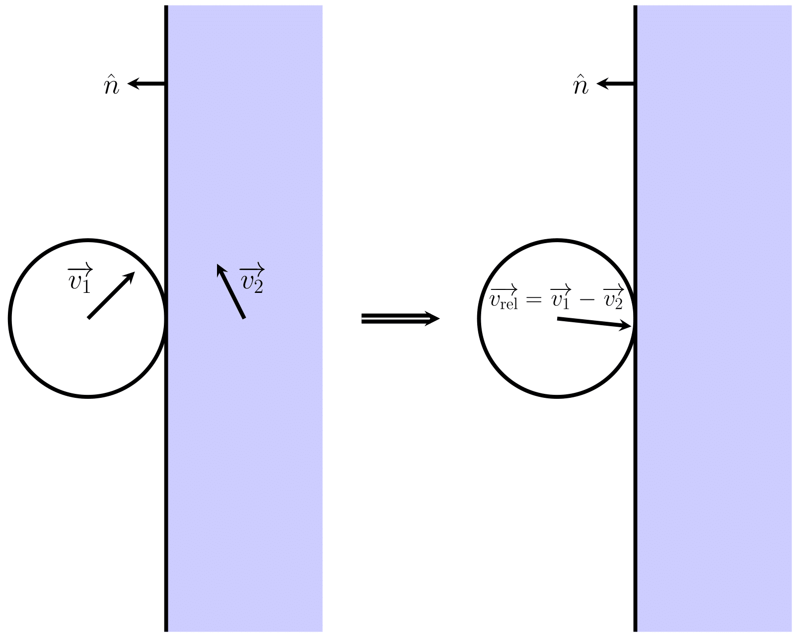

# Physics of collision and friction
## Linear Contraction
We use linear contraction as velocity loss in the following context. Two kinds of contraction is used: tick-based and time-based. 

### Tick-based linear contraction
A tick-based contraction is used when the contraction is applied of a sudden. The transformation is formulated as:
$$\begin{aligned}
f(t=0)\rightarrow f(t=\Delta t)&=\textrm{LC}_{\textrm{tick}}(f(0), \alpha, \beta)\\
&\equiv\max(\alpha f(0)-\beta, \;0)
\end{aligned}$$
Here $\alpha$ is the multiplier, which is a number between $0$ and $1$; $\beta$ is the subtraction constant, which is a non-negative number; $\Delta t$ is the time interval of a tick.

### Time-based linear contraction
A tick-based contraction is used when the contraction is continuously applied. The transformation is formulated as:
$$\begin{aligned}
f(t=0)\rightarrow f(t=dt)&=\textrm{LC}_{\textrm{time}}(f(0), dt, \gamma, \delta)\\
&\equiv\max(f(0)-dt\cdot(\gamma f(0)+\delta), \;0)
\end{aligned}$$
Here $\gamma$ is the slope multiplier, which is a positive number; $\delta$ is the additional slope constant, which is a non-negative number; $dt$ is a small time interval.

### Change from tick-based to time-based
Suppose that we are using a tick-based contraction and the value never reaches zero. After $n$ ticks, the value is transformed to:
$$\begin{aligned}
f(n\Delta t)&={\textrm{LC}_{\textrm{tick}}}^{n}(f(0), \alpha, \beta)\\
&=\alpha(\alpha(\alpha(\dots)-\beta)-\beta)-\beta\\
&=\alpha^{n}f(0)-\alpha^{n-1}\beta-\alpha^{n-2}\beta-\dots-\beta\\
&=\alpha^{n}f(0)-\beta\sum_{k=0}^{n-1}\alpha^{k}\\
&=\alpha^{n}f(0)-\beta\frac{1-\alpha^{n}}{1-\alpha}
\end{aligned}$$
Change to function of time by $t=n\Delta t,\;n=\frac{t}{\Delta t}$:
$$f(t)=\alpha^{\frac{t}{\Delta t}}f(0)-\beta\frac{1-\alpha^{\frac{t}{\Delta t}}}{1-\alpha}$$
Take the derivaitve:
$$f^{\prime}(t)=\frac{\log{\alpha}}{\Delta t}\alpha^{\frac{t}{\Delta t}}f(0)+\frac{\beta\frac{\log{\alpha}}{\Delta t}\alpha^{\frac{t}{\Delta t}}}{1-\alpha}$$
The value after a small time interval can be calculated by its taylor seires at $t=0$ to the first order:
$$\begin{aligned}
f(dt)&\approx f(0)+dt\cdot f^{\prime}(0)\\
&=f(0)+dt\cdot\left(\frac{\log{\alpha}}{\Delta t}f(0)+\frac{\beta\frac{\log{\alpha}}{\Delta t}}{1-\alpha}\right)\\
&=\boxed{f(0)-dt\cdot\left(\frac{-\log{\alpha}}{\Delta t}f(0)+\frac{-\beta\log{\alpha}}{\Delta t(1-\alpha)}\right)}
\end{aligned}$$
Therefore the time-based constants are $\gamma=\frac{-\log{\alpha}}{\Delta t}$ and $\delta=\frac{-\beta\log{\alpha}}{\Delta t(1-\alpha)}$.

### Change from time-based to tick-based
Suppose that we are using a time-based contraction and the value never reaches zero. The general solution can be derived from the differential equation:
$$
f^{\prime}(t)=-\gamma f(t)-\delta\\
f^{\prime}(t)+\gamma f(t)=-\delta\\
e^{\gamma t}f^{\prime}(t)+\gamma e^{\gamma t}f(t)=-\delta e^{\gamma t}\\
e^{\gamma t}f(t)=-\frac{\delta}{\gamma}e^{\gamma t}+C\\
f(t)=-\frac{\delta}{\gamma}+Ce^{-\gamma t}\\
t=0\Rightarrow C=f(0)+\frac{\delta}{\gamma}\\
f(t)=-\frac{\delta}{\gamma}+\left(f(0)+\frac{\delta}{\gamma}\right)e^{-\gamma t}\\
\boxed{f(\Delta t)=e^{-\gamma\Delta t}f(0)-\frac{\delta}{\gamma}(1-e^{\gamma\Delta t})}
$$
Therefore the tick-based constants are $\alpha=e^{-\gamma\Delta t}$ and $\beta=\frac{\delta}{\gamma}(1-e^{\gamma\Delta t})$. The two parameter transformations are consistent with each other.

## Collision
First we consider a collision between a ball and a massive object. Let the velocity and the mass of the ball be $\overrightarrow{v_{1}}, m_{1}$ respectively, and $\overrightarrow{v_{2}}, m_{2}$ for the massive object. Also, let the normal vector of the contact point be $\hat{n}$. For convenience, we choose change the frame of reference from background frame to object frame (since the object is considered to infinitely massive, this is also the center-of-mass frame). The velocity of the ball in this frame is thus:
$$\overrightarrow{v_{\textrm{rel}}}=\overrightarrow{v_{1}}-\overrightarrow{v_{2}}$$

A collision occurs if and only if the ball is moving toward to the object, i.e. $\overrightarrow{v_{\textrm{rel}}}\cdot\hat{n}<0$. For now, suppose that the collision is perfectly elastic. We split the velocity to parallel and perpendicular components (relative to the surface), 
$$\overrightarrow{v_{\textrm{rel}}}=v_{\textrm{rel}, \perp}\cdot\hat{n}+\overrightarrow{v_{\textrm{rel}}}_{, \parallel}$$
The parallel component of the velocity is invariant, and the perpendicular component is trasformed by one-dimensional collision:
$$v_{\textrm{rel, }\perp}\rightarrow v_{\textrm{rel, }\perp}^{\prime}=\frac{m_{1}-m_{2}}{m_{1}+m_{2}}v_{\textrm{rel, }\perp}+\frac{2m_{2}}{m_{1}+m_{2}}\cdot0$$
Then we take the mass limit $m_{2}\to\infty$:
$$v_{\textrm{rel, }\perp}\rightarrow v_{\textrm{rel, }\perp}^{\prime}=-v_{\textrm{rel, }\perp}$$
which is the formula for a two-dimensional perfectly elastic collision. Now we add the energy loss to the system. The energy loss is simplfied to ticked-based linear velocity contraction:
$$v_{\textrm{rel, }\perp}^{\prime}\rightarrow v_{\textrm{rel, }\perp}^{\prime\prime}=\textrm{LC}_{\textrm{tick}}(v_{\textrm{rel, }\perp}^{\prime}, \alpha_{c}, \beta_{c})$$
where $\alpha_{c}$ and $\beta_{c}$ are the collision parameters which can be set arbitrarily. Therefore the total transformation of the perpendicular velocity is:
$$\boxed{v_{\textrm{rel, }\perp}\rightarrow v_{\textrm{rel, }\perp}^{\prime\prime}=\textrm{LC}_{\textrm{tick}}(-v_{\textrm{rel, }\perp}, \alpha_{c}, \beta_{c})}$$
By adding back the parallel component and then change back to background frame (by adding the velocity of the massive object) we can get the final velocity of the ball after collision. We also apply friction when in collision, which affects the parallel component of the velocity. See below.

## Sliding Friction
